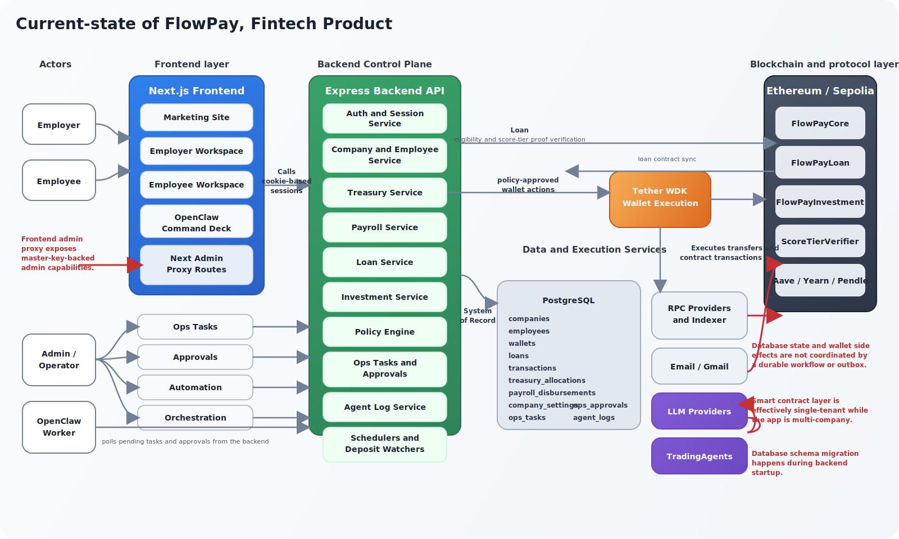
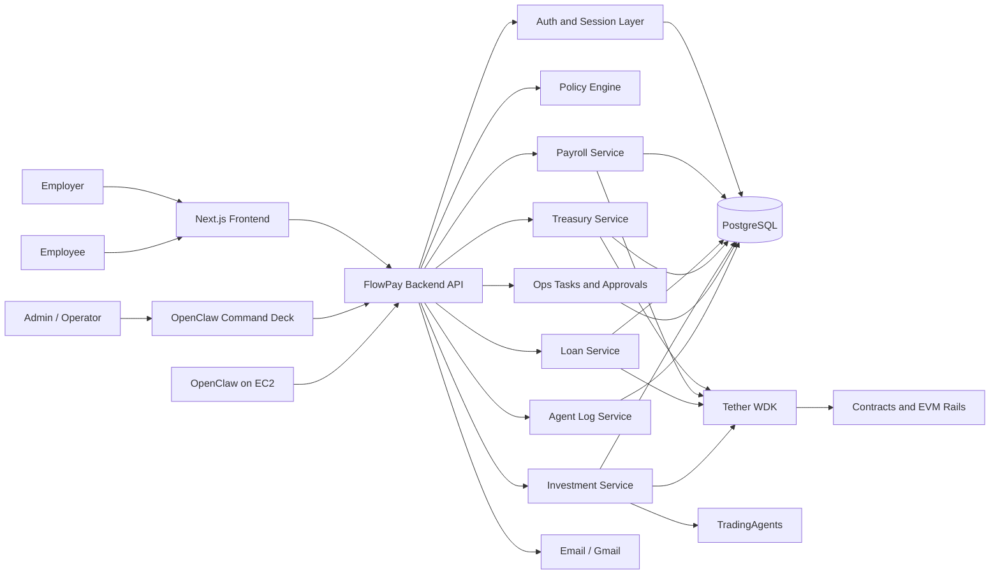

# FlowPay

**FlowPay is a policy-controlled financial operating system for treasury, payroll, employee wallets, lending, and agent-driven finance operations.**

It combines employer treasury control, employee financial access, salary-linked credit, programmable investment routing, and auditable automation in one product. The core idea is simple: financial operations should feel like software, but they should never become ungoverned.

## Executive Summary

FlowPay turns fragmented finance workflows into a coordinated operating system:

- employers receive a treasury workspace
- employees receive a wallet and salary workspace
- agents can recommend and trigger workflows
- the backend remains the policy authority
- wallet execution happens only through controlled server-side flows
- every meaningful action is recorded as an audit trail

This is not just a wallet app, a payroll dashboard, or an AI demo. It is an attempt to make company finance operations programmable without removing human control.

## The Problem

Modern business finance is still fragmented across tools and teams:

- treasury sits in one system
- payroll sits in another
- employee financial access is disconnected from treasury visibility
- loans and repayments are handled outside the salary loop
- automation exists, but usually without real policy enforcement

The result is operational drag, limited visibility, and weak automation. Companies can automate reminders, but not financial execution in a controlled way.

## The FlowPay Thesis

FlowPay treats treasury, payroll, employee wallets, credit, and capital allocation as one operational graph.

Instead of building separate tools for separate functions, FlowPay creates a single control surface where:

- treasury can be allocated into clear operational buckets
- employees can be onboarded into wallet-based financial workflows
- payroll can run with salary-cycle protections
- salary-linked loans can be issued and repaid inside the payroll loop
- investment decisions can be routed through agent recommendations and policy checks
- operational tasks can be delegated to OpenClaw without giving the agent direct wallet authority

## What FlowPay Does

### Employer Treasury Operations

- company onboarding with managed treasury wallet creation
- treasury balance visibility and allocation snapshots
- payroll reserve, lending pool, investment pool, and retained reserve tracking
- treasury withdrawals through backend-controlled execution
- configurable wallet policy controls

### Employee Financial Operations

- employee invitation, activation, and wallet provisioning
- employee wallet visibility
- salary receipt and transaction history
- salary-linked loan requests
- account recovery and credential reset flows

### Automation and Control

- OpenClaw orchestration on EC2
- ops tasks and approval queues
- policy evaluation before execution
- human review thresholds for sensitive actions
- audit logging across decision, policy, and execution stages

### Financial Workflows

- treasury allocation
- payroll execution
- EMI deduction during payroll
- salary-linked loan disbursal
- investment routing
- reserve wallet treasury top-ups

## Why FlowPay Is Different

Most finance products automate interfaces. FlowPay automates workflows.

What makes the system distinct is its separation of responsibilities:

- **OpenClaw** reasons about actions and operations
- **FlowPay backend** validates policy, sessions, scope, and workflow rules
- **Tether WDK** provisions wallets and executes transactions
- **PostgreSQL** stores business state and audit history
- **Contracts and protocol integrations** extend state and execution onto chain

That separation is the product.

Agents do not hold treasury authority. Browsers do not sign treasury actions. Execution must pass through backend policy checks. This is what makes FlowPay suitable for autonomous finance operations without becoming an uncontrolled autonomous wallet.

## Product Surfaces

### Employer Workspace

The employer side of FlowPay is the operational cockpit for company finance:

- treasury overview
- employee management
- payroll operations
- lending visibility
- investments
- transactions
- policy settings
- OpenClaw command surfaces

This is where the company sees capital allocation, payroll readiness, lending exposure, execution history, and agent activity.

### Employee Workspace

The employee side is deliberately narrower and clearer:

- wallet overview
- salary receipts
- loan access
- transaction history
- account settings

Employees interact with their own financial lifecycle, not the employer treasury.

### OpenClaw Command Deck

The command deck is the operational layer for judges, operators, and admins:

- trigger strategy runs
- launch autonomous demo flows
- inspect pending approvals and tasks
- review agent logs
- visualize the decision-to-execution pipeline

It is designed to make the system legible, not just functional.

## System Architecture

<p align="center">
  
</p>

FlowPay is organized as a backend-centric financial control plane. The frontend presents employer, employee, and operator surfaces, while the backend owns policy validation, workflow orchestration, wallet execution, audit logging, and all durable business state.

Below is a simplified logical view of the same architecture:



## Core Workflow Model

Every major workflow in FlowPay is designed around the same execution pattern:

1. **Decision**  
   An agent, workflow, or operator proposes an action.

2. **Policy Validation**  
   FlowPay checks company settings, wallet permissions, transfer caps, daily outflow limits, exposure thresholds, and review rules.

3. **Execution**  
   If allowed, WDK or contract execution performs the financial action.

4. **Recording**  
   State, transactions, approvals, and audit logs are written back into the system of record.

This is one of the most important architectural properties of the product: the system is built to make automation inspectable.

## End-to-End Product Flows

### 1. Employer Onboarding

An employer creates a company, receives a treasury wallet, and gains access to the employer workspace through backend-issued session controls. The wallet is provisioned server-side and stored under encrypted custody.

### 2. Employee Invitation and Activation

An employer adds an employee, FlowPay provisions an employee wallet, and the employee completes activation through an invitation flow. This creates a direct link between workforce identity, salary operations, and wallet-based financial access.

### 3. Treasury Allocation

FlowPay applies a structured treasury split so capital is visible and operational:

- salary reserve
- lending pool
- investment pool
- retained reserve

This gives employers a usable model of capital, rather than one undifferentiated wallet balance.

### 4. Payroll Execution

Payroll runs through backend scope checks and wallet policy validation, then executes salary transfers through WDK. The system also records payroll disbursements per cycle so the payroll loop behaves like a real operating cycle instead of a raw transfer function.

### 5. Salary-Linked Loans

Employees can request loans from their workspace. FlowPay combines salary, score, repayment context, and agent reasoning, then applies company wallet policy before any disbursal is allowed. If approved, funds move through the treasury execution path rather than an uncontrolled agent path.

### 6. EMI Collection

Repayment is tied to payroll. When payroll runs, EMI deductions can be collected as part of the salary cycle, allowing lending and payroll to behave as one system instead of unrelated modules.

### 7. Investment Routing

Eligible treasury capital can be routed into investment positions with policy constraints. FlowPay uses agent analysis for posture and allocation, but still routes final execution through backend policy checks and controlled wallet execution.

### 8. Reserve Treasury Top-Ups

When treasury is short of funds for an operational action, FlowPay can use a configured reserve wallet to top up the treasury under bounded policy rules. This creates a practical bridge between monitoring, automation, and execution.

## Security and Control Model

FlowPay is opinionated about safety.

The architecture is designed around a few non-negotiable principles:

- the browser is not the policy authority
- the browser is not the signing authority
- agents do not directly control treasury keys
- all sensitive actions must pass backend scope and policy checks
- financial workflows are logged across decision, policy, and execution stages

Key controls in the current product include:

- company PIN-based access control
- employee password-based access control
- signed HTTP-only session cookies
- encrypted wallet seed storage
- transfer caps and daily outflow controls
- policy-based loan and investment constraints
- review thresholds for higher-risk actions
- auditable ops tasks and approval queues

## Auditability

FlowPay exposes its automation instead of hiding it.

Major workflows are logged with staged visibility such as:

- `decision`
- `policy_validation`
- `wdk_execution`
- workflow-level execution status

This gives operators and judges a direct view into:

- what the system decided
- what policy allowed or blocked
- what actually executed
- what still requires review or retry

## OpenClaw in the Product

OpenClaw is not an add-on in FlowPay. It is part of the operating model.

OpenClaw runs on EC2 and is used to:

- trigger orchestration runs
- process ops tasks
- resolve approvals
- handle admin workflows
- drive the autonomous demo path
- support operational automation through a controlled CLI and backend surface

OpenClaw is allowed to reason, coordinate, and trigger. It is not allowed to bypass backend controls or directly own treasury execution.

## Technical Stack

| Layer | Technology |
| --- | --- |
| Frontend | Next.js 14, React, TypeScript, Tailwind |
| Backend | Express, TypeScript, Zod |
| Database | PostgreSQL |
| Wallet Execution | Tether WDK |
| Automation | OpenClaw on EC2 |
| AI Services | OpenAI / Anthropic / Gemini adapters, TradingAgents integration |
| Blockchain | Hardhat, Solidity, EVM-compatible contracts |
| Messaging | Gmail / email flows |
| Proof Layer | zk score-tier proof generation and verifier support |

## Repository Structure

```text
frontend/    Next.js employer, employee, and command-deck UI
backend/     Express API, policy engine, schedulers, wallet execution, automation
blockchain/  Solidity contracts, Hardhat config, deploy scripts
skills/      OpenClaw skills used for FlowPay operations
```

## Current Project Status

FlowPay is an end-to-end product prototype with real architectural depth across:

- employer onboarding
- employee onboarding and activation
- managed wallet creation
- treasury views and allocation
- payroll flows
- salary-linked lending
- investment workflow support
- reserve wallet top-ups
- ops tasks and approvals
- OpenClaw orchestration
- audit-trace visibility across the workflow stack

The system is already structured as a real finance operations product, not just a visual mockup.

## Demo Narrative

The strongest way to understand FlowPay is as one continuous business loop:

1. onboard a company and provision its treasury wallet
2. invite employees and activate their wallets
3. fund treasury and allocate capital
4. request and approve a salary-linked loan
5. execute payroll with EMI deduction
6. inspect the audit trail from decision to policy to execution
7. trigger OpenClaw to operate the system through the command deck

That end-to-end continuity is the main product claim.

## Closing

FlowPay is building toward a future where finance operations are programmable, agent-assisted, and still firmly governed.

It is a financial operating system where treasury, payroll, lending, investment routing, employee access, and operational automation are treated as one coordinated product.
